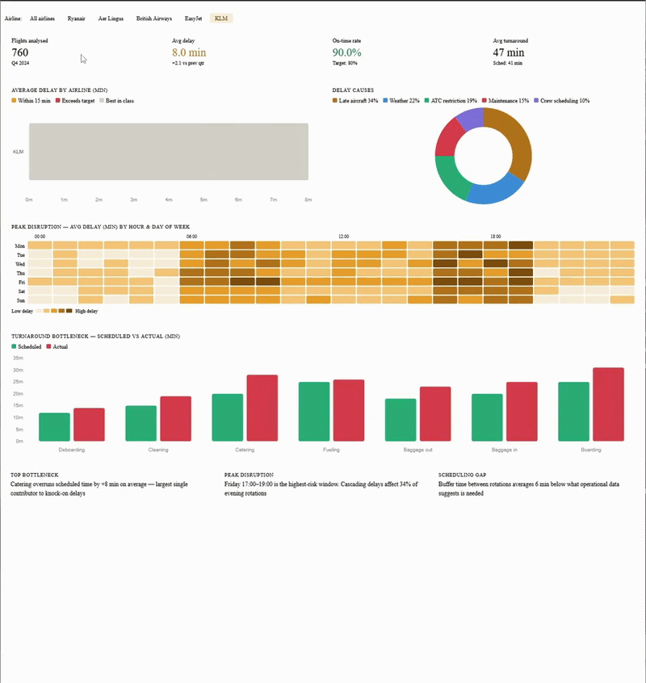

# ◈ Interactive Flight Analysis Dashboard

> **Analyse 12,500+ simulated flight records to surface delay patterns, peak disruption windows, and turnaround bottlenecks — running entirely in the browser.**

---

## What is this?

This project is a **browser-based flight operations analytics dashboard**. It models the kind of data analysis a planning or performance team would run after a disrupted quarter. Identifying which carriers delay most, when disruptions peak, and where turnaround time is being lost.

It simulates a dataset of 12,500+ flight records across 8 European carriers, with a seeded PRNG engine that produces consistent, realistic-looking operational data on every load. The dashboard lets you filter by airline, cross-reference delay causes, and read bottleneck data from a turnaround stage breakdown.

**Built to explore:** how operational flight data can be turned into clear, decision-ready insight for non-technical stakeholders. Without a backend, database, or data pipeline.

---

## Development Note

This project was originally developed as a private prototype and later published here as a public portfolio project. The commit history has been condensed as part of that transition.

---

## Demo

> Live dashboard showing airline delay comparison, peak disruption heatmap, and turnaround bottleneck breakdown

---